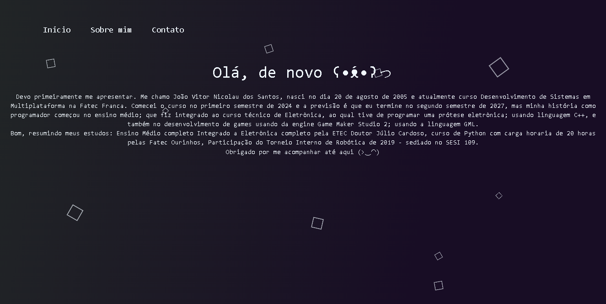

<h1>Curriculo-base-HTML-CSS</h1>

Com objetivo de ajudar e aprimorar os aprendizados dos alunos de Desenvolvimento de Sistemas em Multiplataforma, o professor Márcio(Desenvolvimento Web 1) sugeriu que criassemos um site básico baseado em nossos currículos, nos apresentando e dizendo nossas qualidades básicas.

<h3>Pré-Requisitos:</h3>

Instale o Visual Studio Code e seja feliz :D

<h3>Imagens utilizadas no projeto:</h3>

  <h6>No projeto foram usadas imagens apenas para os icones de rede sociais</h6>

 

<h3>Eis aqui está o link do meu currículo:</h3>
https://joao-vitor-nicolau.netlify.app/?classId=37e2308e-350a-47a0-9146-9ba0883a9999&assignmentId=9654d039-0239-41f8-af9b-357f7bacc96c&submissionId=60d48056-51b3-cfd5-5a12-3d458cc3cee5

<h3>Eis um tutorial básico de como usa-lo:</h3>

  

 
  <h4>Essa primeira aba(Ínicio) eu me apresento e falo o básico de quem sou eu.</h4>

 
 

  

 
  <h4>Essa segunda aba(Sobre mim) eu especifico algumas de minhas experiencias na área.</h4>

 
 

  

 
  <h4>Essa terceira aba(Contato) é onde se encontram minhas informações pessoais e meios de contato.</h4>

